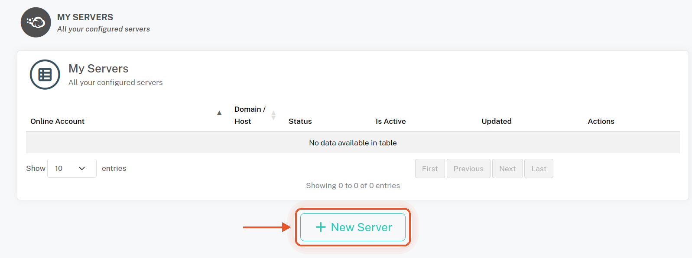
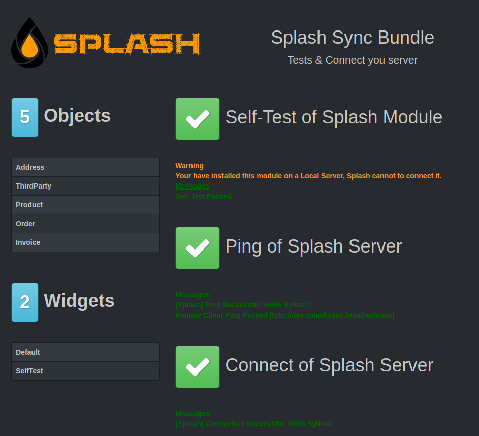

### Installer via Composer

Téléchargez le plugin Splash pour Sylius et ses dépendances dans le répertoire vendor. Vous pouvez utiliser Composer pour automatiser l'opération :

```bash
$ php composer.phar require splash/sylius-splash-plugin
```

Composer installera le bundle dans le répertoire `vendor/splash`.

### Ajouter le bundle au kernel de votre application

```php
// app/AppKernel.php

public function registerBundles()
{
    $bundles = array(
        // ...
            new \Splash\Bundle\SplashBundle(),                          // Splash Sync Core PHP Bundle
            new \Splash\SyliusSplashPlugin\SplashSyliusSplashPlugin(),  // Splash Bundle for Sylius
        // ...
    );
}
```

### Connexion à votre compte Splash

Vous devez d'abord créer les clés d'accès de votre module sur notre site. Pour cela, dans l'espace de travail Splash, allez dans **My Servers**, cliquez sur **New Server** et notez l'identifiant et la clé de chiffrement.



### Configurer les bundles Splash

Voici la configuration par défaut des bundles Splash :

```yaml
splash:
    id:                 ThisIsSyliusWsId                # Your Splash Server ID
    key:                ThisIsSyliusWsEncryptionKey     # Your Server Secret Encryption Key

splash_sylius_splash:
    default_channel:    FASHION_WEB                     # Select here your shop default channel
```

### Configurer les routes Splash

Ajoutez les routes du bundle Splash à votre configuration :

```yaml
splash_ws:
    resource:   "@SplashBundle/Resources/config/routing.yml"
    prefix:     /ws
```

### Tester et connecter votre serveur

Une fois le serveur créé dans votre compte, vous devez le déclarer.

Pour cela, ouvrez votre navigateur à l'adresse "http://my.webshop.com/ws/splash-test".



### Prérequis

- PHP 7.4+
- Sylius 1.6+
- Un compte utilisateur Splash Sync actif
